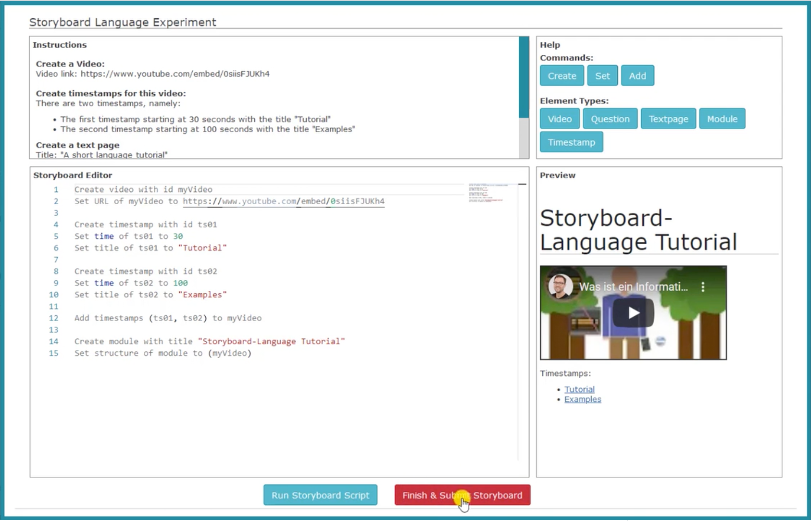
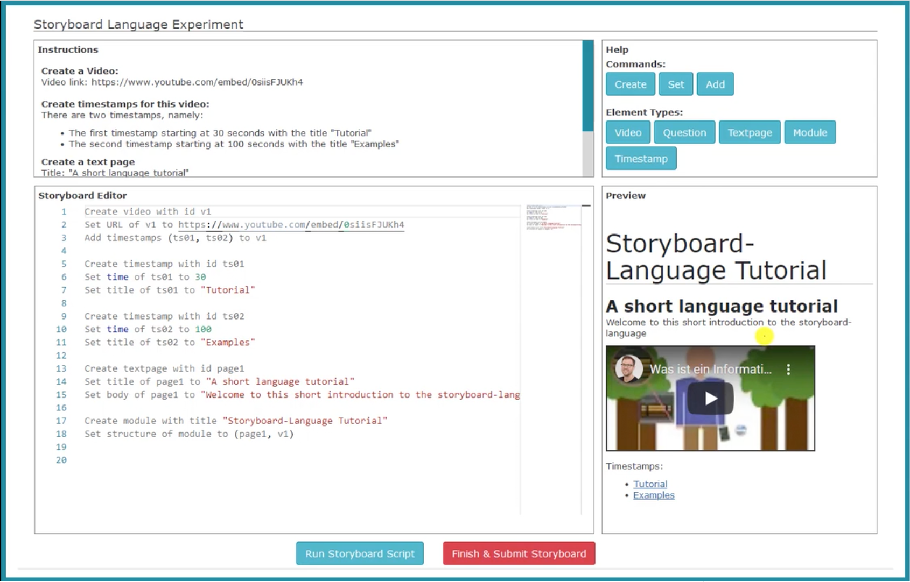
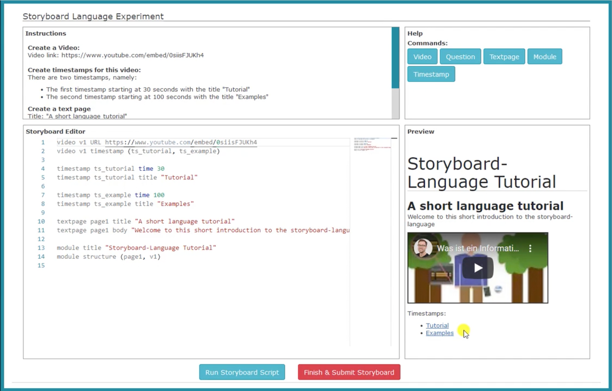

## Tutorial Videos for Storyboard Language Experiment

### Introduction to Online Storyboard Editor Environment

Link: https://vimeo.com/730321158

### Tutorial: Natural Language Notation

Link: https://vimeo.com/730321999

### Tutorial: Key-Value Notation

Link: https://vimeo.com/730321400

